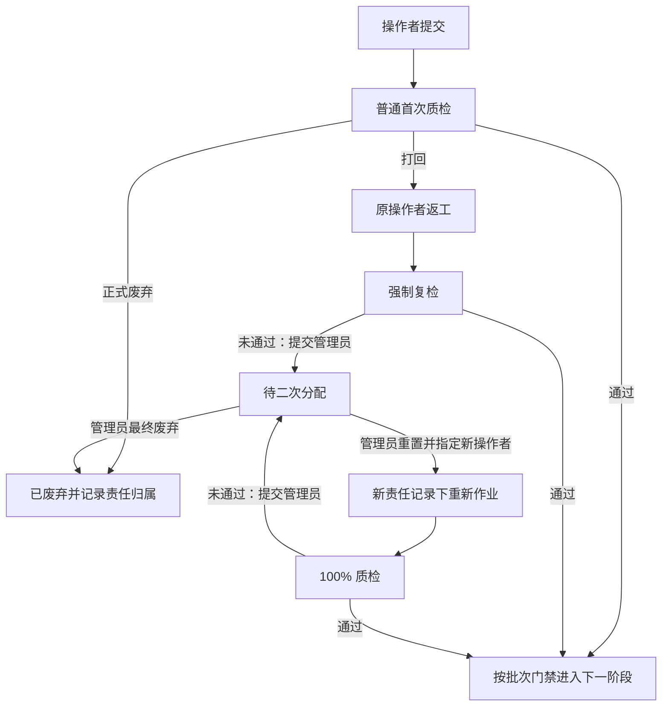

# 账号三项比例、强制复检与待二次分配改造方案

方案日期：2026-09-22。状态：设计方案，尚未实施业务代码、数据库迁移或部署。

后续调整（2026-09-23）：图片强制复检恢复可反复打回返修，不再触发二次分配；下文涉及图片“仅通过或提交管理员”的内容保留为原始设计记录。当前行为以实施说明和代码为准。

本方案根据当前工作区代码编写；其中已有未提交的文案质检修改，因此以实际代码为依据，不将旧文档描述直接视为当前实现。当前业务中心使用 PostgreSQL；本次涉及的账号、分配、质检和统计应落在中心数据库，不在本地 SQLite 队列另建统计来源。

## 1. 业务结论与适用范围

此次改造需要同时解决统计口径、复检处置和改派留痕，不能只在账号页增加三个百分比。

1. 账号数据展示“废弃率、一次通过率、打回率”，三项使用同一个样本集合，互斥且穷尽，有样本时合计 100%。
2. 强制复检只允许“通过”或“提交管理员”。不再打回原操作者继续循环返工，也不从强制复检入口直接废弃。
3. 提交管理员后，任务立即进入“待二次分配”，退出普通操作者和质检员的可操作队列，管理员统一处置。
4. 保留原操作者的数据贡献、质检结论与分配历史。重新分配只改变当前工作归属，不转移历史数据。
5. 三个率按质检人员实际提交有效结论的时间归属，采用北京时间。昨天生成或提交、今天质检的数据归今天。
6. 用户已明确选择：**打回后最终废弃，改计废弃；允许历史统计随最终结果更新。** 因此“归属不变”是账号、统计日期和样本身份不变，并非分类永远不变。
7. 用户进一步明确：**二次分配必须恢复初始数据，删除前标注人的更改内容和更改记录。** 本方案据此修订，取消“保留前任改稿作为参考”的设计；仅保留独立的分配、提交工作量和质检统计账本。

建议文案、图片两个阶段同时采用以上规则，各自计算一组三个率。一组图片计一条，不能把每张图片当一条，也不能把文案与图片合并称为成品数。页面保留现有“标注／质检”工作类型切换：三个率衡量内容操作者的结果；质检人员工作量按实际执行的质检操作另计。

## 2. 当前系统现状与缺口

| 已核对的实现 | 当前行为 | 本次改造 |
| --- | --- | --- |
| `app/workbench-statistics/operator-performance.tsx` | 账号数据按标注／质检切换；标注主要展示提交条数、首检通过率、退回和返修条数 | 新增已判定总量与三项互斥分类，调整列说明、排序和明细 |
| `src/operator-performance.mjs` | `PERFORMANCE_VERSION = 4`；首检通过率只看任务某阶段的首次随机抽检 PASS／RETURN | 新口径单独版本化，不静默复用旧公式 |
| `server/migrations/0072_operator_performance.sql` | 已有 `operator_performance_events`、`operator_stage_events`；历史事实不随任务或账号级联删除 | 复用事实层，追加归属绑定与分类变更事件 |
| `0075_quality_review_activity.sql`、`0076_quality_inspection_links.sql` | 已有质检员工作量和持久化质检父链；图片质检废弃属于独立活动 | 把有效废弃纳入操作者新分类；增加提交管理员活动 |
| `0017_task_assignment.sql` | 已有 `task_assignment_events`，记录前后负责人和原因，但主要保存用户名，任务删除会级联删除 | 保留兼容日志，增加以稳定账号 ID 为基础的责任区间记录 |
| `server/src/copy-quality-control.mjs` | 强制复检仍可 `RETURN_SINGLE`，继续派生返工版本；打回后确认废弃另记 `copy_return_dispositions` | 新增升级管理员动作，禁止强制复检继续退回 |
| `server/src/image-quality-control.mjs` | 待检项支持通过、打回、废弃；质检复检未统一收敛为两个动作 | 强制复检只保留通过、提交管理员 |
| `PostgresControlPlaneRepository.assignTasks()` | 普通撤销分配只允许指定的文案阶段；不能直接把质检中任务清空负责人 | 增加专用管理员处置事务，不能只调用普通改派接口 |
| `src/quality-rounds.mjs` | 连续两次有效退回仅形成“建议改派”提示 | 新流程改成真实的“待二次分配”池；旧提示仅兼容存量 |
| 文案／图片冻结批次放行逻辑 | 返工链未解决会阻塞批次；图片有祖先轮次释放处理 | 将移交管理员明确记为“从原批次移出”，重新计算其余成员门禁 |
| `0085_shared_quality_queues.sql` | 质检已改为共享队列，待检预分配账号字段不再承担授权作用 | 不按 `assigned_review_account_id` 推断实际质检人或个人待办 |

最后一项还有现存兼容缺口：`server/src/quality-review-statistics.mjs` 的待办查询仍依赖质检预分配字段。落地时必须同步修正为共享队列可处理范围，不能在新页面沿用这套个人指派待办口径。

## 3. 三个率的完整统计口径

### 3.1 什么是“一条账号数据”

新口径的统计主体为：

`任务 ID × 内容阶段 COPY/IMAGE × 实际操作者账号 ID`

相同操作者处理同一任务、同一阶段，重复保存、重提、复检、恢复或再次获派，不重复增加该账号的质量样本。分配次数、提交次数、复检次数另计。

A 做完后改派给 B：A 的主体保留；B 实际提交并被质检后建立 B 的主体。团队可以有两条“账号贡献样本”，但业务仍是一条任务。汇总页面分别展示贡献样本数与去重任务数，不能将两者混用。

**已判定总量包含已经被二次分配出去的数据。** 例如 A 已判定 100 条，其中 10 条后来二次分配，A 的已判定总量仍为 100，并标记“其中已二次分配 10 条”，不变成 90，也不额外增加到 110。B 刚接收不增加已判定量；B 实际完成质检后才计入 B 的对应日期。该标记是总量的子集，不能与废弃、一次通过、打回并列为第四类结果。

新口径与旧版“每任务阶段只取最早随机抽检”不同。重新接手者的首次有效质检也可形成自己的样本；页面说明“一次通过是该账号处理该任务该阶段后的首次有效质检通过”。旧版任务首轮随机抽检指标如保留，应明确标为旧口径。

### 3.2 分母

对某账号、某阶段和某时间范围：

`N = 范围内首次形成有效人工质检结论的账号质量记录数`

分母不是期间创建量、分配量、提交量，也不是当前仍属于该账号的任务数。

纳入条件：有可信实际操作者、有效版本、独立人工质检结论以及真实质检时间。管理员正常执行独立质检可以纳入；管理员快捷直放、自检、明确模拟、无法确认身份或时间的数据不纳入。

下列数量单独显示：

- 当前待处理、待质检、待二次分配等积压数量。已形成有效结论的数据，即使当前待二次分配或已经改派，原账号的历史样本仍在分母内；这里单列的是当前队列数量。
- 已提交但尚未质检、普通抽检未抽中、免检或例外放行。
- 未经过质检的操作者自行废弃、业务取消和重复 Query 清理。
- 批次连带退回但没有逐条质检结论的数据。
- 历史证据不完整的数据。

这是满足“按质检操作时间统计”的必要边界：未经过质检的废弃没有质检时间，不能直接拿创建时间或废弃时间冒充。若还需要全量作业废弃率，应另列“全量作业处置”指标；不要混入这三个率。它是本方案明确提出的口径，实施前应与业务验收样例一起确认。

### 3.3 分类与公式

每条已纳入记录只有一个当前有效分类，优先级为“有效废弃 > 曾经未通过 > 首次通过”：

| 分类 | 定义 | 典型情形 |
| --- | --- | --- |
| 废弃 `DISCARDED` | 当前存在归属于该责任记录的有效最终废弃处置 | 首检直接废弃；首检打回、复检失败后管理员废弃 |
| 一次通过 `FIRST_PASS` | 未被最终废弃，首次有效质检通过，且该责任记录后续没有有效质量退回／不通过 | 首检通过；B 接手后的首次全量质检通过 |
| 打回 `RETURNED` | 未被最终废弃，发生过有效质量不通过 | 首检打回；打回后复检通过；复检未通过转管理员；后续检查发现同一责任记录不通过 |

`废弃率 = D / N × 100%`

`一次通过率 = P / N × 100%`

`打回率 = R / N × 100%`

约束：`N = D + P + R`。

“打回后复检通过”仍归打回，因为它没有一次通过；可以增加复检通过数量，但不能把它改写成一次通过。“提交管理员”是流程动作，不是第四种比例，也不增加一次新的打回操作。

若 B 接手后首个质检属于强制检查，未通过会直接提交管理员。B 的首次结果归“打回”统计类，原因细分为“未通过转管理员”；页面说明这个统计类涵盖质量未通过，并不意味着系统向 B 执行了一次退回按钮动作。

零样本时三项均返回 `null`、显示“—”，不显示三个 0% 或虚构 100%。有样本时后台保存整数计数与高精度比值，页面三项统一做舍入分配。例如三类各 1 条，保留一位小数展示为 33.4%、33.3%、33.3%，确定性的最大余数法保证展示合计 100.0%。明细和 CSV 同时给出计数及展示比例。

### 3.4 用户已确认的“最终废弃回写”

例：某账号昨天的统计为 `N=10、P=7、R=3、D=0`；今天管理员把其中一条打回数据最终废弃。

昨天的当前报表更新为：`N=10、P=7、R=2、D=1`，三个率为 70%、20%、10%。

处理规则：

1. 原打回事件保留，不能删掉或改写。
2. 追加最终废弃事件，更新这条记录的当前分类，附管理员、原因及时间。
3. 原账号不变、原统计日不变、分母不变。
4. 今天增加管理员的废弃处置操作记录，但不再增加该原账号的一条首检样本。
5. 原页面已经生成的快照和 CSV 保持当时结果；用户刷新后取得新的结果与新的快照。
6. 明细展示“首次结论：打回；当前分类：废弃；于某时由某管理员确认”。

需要纠正误废弃或恢复作业时，追加撤销／恢复事件并重算分类：有历史不通过则回到打回，无历史不通过且有首检通过则回到一次通过。只在属于同一责任记录的处置被明确撤销时改变它；单纯重新分配不撤销废弃。

### 3.5 废弃归谁、影响哪个阶段

废弃处置必须带明确的责任记录引用，不能依据操作当时的 `tasks.assigned_to_user_id` 决定归属，也不能仅凭任务最终 `CANCELLED` 给所有参与人统一扣分。

- A 的复检提交管理员，管理员在这个处置单中废弃：A 对应阶段的质量记录改计废弃。
- 管理员将 A 的数据交给 B：A 的原打回分类保留；分配给 B 不会把它删掉，也不会变为 B 的打回。
- B 后续实际作业并形成自己的质检记录：B 自己记一条；B 后续废弃默认只影响其关联的责任记录，A 不自动变为废弃。
- 如果业务判定最终废弃同时归因于多段责任，管理员必须显式选择有证据的责任记录并留原因，不能按当前负责人或所有历史参与人自动扩散。
- 图片问题导致整条任务停用，不自动把此前合格的文案计为文案废弃。图文都有问题时明确记录影响阶段，分别处置。
- 操作者在“未经过质检”时自行废弃不纳入三个率；已经有有效质检记录的后续正式质量废弃，可以更新该记录。
- “建议废弃”只是建议；必须由有效权限提交正式处置后才改计废弃。

这里把“最终结果”落实到有责任归属的作业记录，避免改派后用新人的结果覆盖前任成绩。用户已确认打回后最终废弃改计废弃；跨多个责任人的连带归因规则是本方案的建议，需作为验收口径明示。

## 4. 时间口径：用质检时间，同时支持历史结果更新

每条质量记录区分四个时间：

| 字段 | 含义 | 用途 |
| --- | --- | --- |
| `submitted_at` | 操作者实际提交时间 | 提交工作量 |
| `first_qa_at` | 首个有效人工质检结论的服务端时间 | 三个率的固定统计归属日 |
| `outcome_changed_at` | 当前分类最后改变时间 | 追溯历史变动 |
| `recorded_at` | 事实写入时间 | 回填、补录和报表快照审计 |

主统计按 `first_qa_at` 归日；打开任务、领取、开始浏览、保存草稿不构成有效结论。时间由中心数据库生成，不信任客户端传来的操作时间。存储使用 `timestamptz`，日期范围按 `Asia/Shanghai` 的左闭右开区间计算。

| 时间过程 | 统计结果 |
| --- | --- |
| 9 月 21 日创建／提交，9 月 22 日质检通过 | 一次通过计入 9 月 22 日 |
| 9 月 21 日质检打回，9 月 22 日复检通过 | 样本仍归 9 月 21 日的打回；22 日另计复检通过操作 |
| 9 月 21 日打回，9 月 22 日管理员最终废弃 | 回写 21 日：打回 -1、废弃 +1、总量不变 |
| 9 月 21 日 A 打回，22 日改派 B，23 日 B 首检通过 | A 仍在 21 日；B 新样本归 23 日，22 日只有改派记录 |
| 9 月 22 日 23:59:59 通过；另条 23 日 00:00:00 通过 | 分别归两个北京时间自然日 |

页面注明：“按首次有效质检日期归属，分类展示截至报表时间的最终处置结果，历史日期可能因后续废弃／恢复而更新。”

这意味着历史查询不能仅加载查询期间的质检事件。必须先选出期间首次质检的质量记录，再读取它们截至 `asOf` 的后续分类事件。否则今天废弃昨天的数据，昨天的报表不会正确更新。后续事件即使发生在筛选结束日以后，仍影响当前刷新出的历史报表。

## 5. 新流程与状态机

### 5.1 普通首检与强制复检



普通文案首检目前没有独立直接废弃结论。如要与图片首检统一三分类入口，增加正式 `DISCARD` 动作及原因审计；不要用“打回并建议废弃”伪装成同一次正式废弃。该新增权限仅针对普通首检，仍沿用中心的账号能力和自检限制。既有建议废弃链也可以继续作为两步处置，但只有最终确认后才切换分类。

所有 `sample_kind = MANDATORY_RECHECK` 的质检项统一只允许 `PASS` 或 `ESCALATE_ADMIN`，包括终审返工、废弃恢复、生图失败修订及二次分配后要求全检的任务。关闭普通抽检、账号抽检比例为 0 或管理员普通直放都不能跳过这类门禁。

“首次／复检”需要分两个维度：物理抽检策略 `sample_kind` 与账号统计顺序 `is_first_for_account`。B 首次接手仍接受 100% 检查，但它可以是 B 自己的首个质量样本，不能因为物理上是强制复检就漏算 B。

### 5.2 新任务状态

建议增加正式枚举 `PENDING_SECOND_ASSIGNMENT`，中文名称固定为“待二次分配”。

同时：

- `current_stage = PENDING_SECOND_ASSIGNMENT`。
- 当前操作者、普通分配来源及当前分配时间清空。
- 关联一个活动管理员处置单 `reassignment_case_id`。
- 保存来源问题阶段 `COPY`、`IMAGE` 或 `BOTH` 用于归责；内容按任务初始基线完整还原，另记还原及清理进度。
- 当前操作入口只对管理员开放；以前的操作者可在历史贡献明细看自己的记录，但没有处理权限。
- 当前质检项结束为 `ADMIN_ESCALATED`；此前通过／打回事件保留。
- 不纳入普通自动派单、质检共享队列、执行机领取、生图放行或交付池。
- 管理员无需成为任务的名义操作者。管理员池是统一权限范围，不是给某个管理员账号增加制作贡献。

必须是后端正式状态，不能只修改 `progress_message`，否则自动派单和执行机仍可能把它当正常任务处理。

### 5.3 强制复检按钮与权限

| 场景 | 允许动作 |
| --- | --- |
| 普通首检 | 通过、单条打回；有权限时正式废弃及现有批次操作 |
| 强制复检 | 通过、提交管理员 |
| 待二次分配 | 管理员查看、分配已还原的初始数据、最终废弃；重置失败时可修复／重试 |
| 已移交的旧质检项 | 查看本人权限范围内的历史回执 |

前端移除强制复检的打回、直接废弃、整批打回和放行同批其余按钮；后端相同条件硬拒绝，防止旧客户端或直接请求绕过。管理员在强制复检页也遵循两个动作，具体处置从管理员池完成。

共享队列继续禁止非管理员质检自己的提交；统计继续排除管理员自检。盲评响应只返回匿名质检编号、状态与操作回执，不新增原操作者、改派目标账号、任务内部编号或完整分配链。

## 6. “重置成初始状态”的具体含义

按用户补充要求，“初始”固定为**首次人工标注之前的系统原始数据**。新操作者重新标注，不接手前任改稿，也不能查看、恢复或继续使用前任的编辑历史。本轮及更早已结束分配轮次的人工修改不得重新混入当前任务。

原任务 ID、Query、原始素材和原始机器稿保留；前标注人的文案改动、图片规划改动、草稿、改稿版本、图片编辑记录和对应派生产物删除。原操作者是谁、何时提交、何时质检、质检结果及二次分配记录保存在独立统计账本，用于回答本次确认的第一个问题。

移交时先固化必要统计事实与分配关系，再把任务置为“待二次分配”并执行初始还原。只有还原和更改记录清理完成，管理员才能将其分给新操作者。待二次分配期间不会继续生产，也不会把尚未清理的旧稿发给新操作者。

| 项目 | 处理方式 |
| --- | --- |
| 任务 ID、Query、来源批次、原始素材、首次人工标注前的机器原稿 | 保留，用于还原初始数据 |
| 前标注人修改的标题、正文、标签、图片规划 | 删除修改内容，恢复初始版本 |
| 前标注人的草稿、改稿历史、内容差异及编辑提示词 | 清理业务记录及重复存储，不在详情或历史页面提供访问 |
| 前标注人的图片编辑、预览、派生图片 | 删除任务专属编辑记录和派生产物；原始素材及其他任务仍使用的共享资产保留 |
| 旧审核会话、草稿确认、当前评分状态 | 清空当前轮次状态；已形成统计事实的评分结论只保留于独立历史账本 |
| 原操作者提交量、已判定总量、质检时间和分类、分配记录 | 保留，与待删除编辑表解耦；标记已二次分配 |
| 新负责人及新分配区间 | 管理员正式分配时创建 |
| 文案当前版本 | 从可信初始基线建立新的未审核版本，来源为 `SECOND_ASSIGNMENT_RESET`，不复制前任改稿 |
| 图片当前版本及旧放行凭据 | 按初始基线还原；基线尚无图片时清空，后续重新生产；旧文案和图片放行凭据清除 |
| 免审核、历史兼容放行、普通免检 | 清除旧轮次绕过依据，保留本任务重新提交后需全量检查的控制要求 |
| 执行任务、编辑任务、旧浏览器缓存及过期响应 | 旧轮次失效并清理；旧响应不得写回，也不得自动恢复旧草稿 |
| 交付记录 | 撤回受影响版本的 READY 交付及预览访问；保留独立交付事实，已删除产物不再提供下载 |
| 进度、错误、结束时间 | 恢复新作业的初始值，统计账本不变 |
| 优先级 | 默认保留；不会因清空负责人自动进入普通派单 |

### 6.1 初始数据基线

增加不可变的 `task_initial_baselines`，在首次允许人工标注之前保存原始输入、机器稿、原始图片／素材引用、内容哈希和原始作业阶段。该基线不含前标注人的人工修改，且不能被后续保存草稿覆盖。

普通内容任务一般恢复为机器文案生成完成、尚未人工标注的内容上下文；外层仍显示“待二次分配”，管理员分配后进入 `COPY_REVIEW_PENDING`。前标注期间产生的下游图片不能继承；新一轮按文案、图片顺序重新作业。独立图片类任务按其自身首次标注前基线恢复，不强行进入文案流程。

**不再提供“保留前任修改稿”或“仅重置最后一个问题阶段、沿用前任人工内容”的选项。** 来源问题阶段保留用于统计归责，但内容还原以任务初始基线为准。重新作业依然执行全量质检，质量门禁元数据不属于需要删除的人工修改内容。

存量任务先从可信机器生成记录恢复初始基线。无法找到原稿时，将重置标为阻塞并交管理员重新生成，明确这是一份新生成稿，不能把现有人工改稿当成初始稿。基线未就绪时不得执行破坏性内容清理或二次分配。

### 6.2 删除更改记录与保留统计的实施边界

当前审核、抽检与版本表之间存在级联外键。不能直接删除人工版本行而让数据库顺带删除质检事实、冻结批次成员和统计依据。实现顺序必须是：

1. 把提交人、质检人、时间、结果、原因、分配关系和必要版本标识写入独立持久记录，并验证原账号计数。
2. 将仍需保留的质检／批次元数据与编辑内容解耦。源 ID 作为历史标识，不以内容行继续存在为查询前提；必要时保留无内容的技术引用占位，不能保留改稿、差异、图片或编辑提示词。
3. 从初始基线建立新作业数据，更新轮次版本，失效旧会话和旧执行响应。
4. 删除前标注人的编辑记录及其内容副本，包括业务表、草稿、版本内容、编辑请求、执行结果中重复保存的人工修改、预览与可恢复缓存；独立统计／质检结论记录不删除。
5. 对比清理前后的原账号分母、分类和统计日期，确认重置本身没有增减或转移数据。

数据库还原、统计固化及清理清单写入同一事务。文件／对象存储清理由事务提交后的可重试清单完成，跟踪 `reset_status` 和 `cleanup_status`；不得将外部文件删除伪装为数据库可回滚操作。清理未完成的任务留在管理员池，禁止二次分配。使用请求处理和管理员重试入口执行清理，不为此新增生产定时调度。

清理只针对该任务的前标注修改及其派生产物；对共享资产先核对引用，不删除其他任务或原始基线仍需使用的数据。删除后的旧内容在任务详情、历史版本、API、预览和恢复入口均不可读；统计详情显示“前标注修改记录已在二次分配重置时清理”。

现有 `task-restoration.mjs` 仅能借鉴撤回交付和关闭旧放行凭据的方式，不能直接复用：它保留原负责人和旧人工内容，与这次初始还原要求不同。

## 7. 数据模型：分配记录、统计归属与管理员处置

### 7.1 `task_assignment_records`：新增责任区间表

现有 `task_assignment_events` 继续用于兼容审计；新增表承担稳定责任区间。

| 字段 | 含义 |
| --- | --- |
| `id`、`task_id`、`sequence_no` | 分配记录身份及任务内顺序 |
| `assignee_account_id` | 稳定的获派账号 ID |
| `assignee_username_snapshot`、`assignee_display_name_snapshot` | 当时账号信息 |
| `previous_record_id`、`root_record_id` | 前一段与首段分配记录 |
| `assigned_by_account_id`、`source`、`reason` | 分配人、SELF／MANUAL／AUTO／SECOND_ASSIGNMENT 等来源及原因 |
| `assigned_at`、`ended_at`、`end_reason` | 责任区间；结束原因包括改派、移交管理员、完成、废弃 |
| `reassignment_case_id` | 二次分配来源 |
| `request_id`、`version` | 幂等与并发控制 |

规则：每任务最多一个活动责任区间；同负责人无实质变化的请求不得新建记录。关闭旧段时只填写关闭信息，不改旧段的获派账号和开始时间。历史快照不随账号或任务删除级联丢失。

所有分配路径统一写入：首次手动分配、自动分配、查询包产生任务后的实际分配、普通改派、撤销分配、管理员二次分配，以及账号停用触发的归属调整。查询包预分配意向与任务实际获派分开，不把尚未成为任务的包条目计入任务贡献。

“原操作者总量保留一条标记”的实现不是给当前任务表加一个计数，而是保留这段记录，并在统计明细显示“已移交管理员／已二次分配给其他人”。获派量、实际作业量、已判定量分别聚合，不能因为只有获派记录就虚增一次质检样本。

### 7.2 `account_quality_records`：新增账号质量主体及当前投影

| 字段 | 含义 |
| --- | --- |
| `id`、`task_id`、`stage`、`operator_account_id` | 唯一统计主体 |
| `operator_username_snapshot`、`operator_display_name_snapshot` | 原操作账号快照 |
| `first_assignment_record_id` | 首次有效提交对应的责任区间 |
| `first_approval_event_id`、`first_sampling_item_id` | 可信提交及首个有效结论来源 |
| `first_qa_at`、`first_reviewer_account_id` | 固定统计时间及判定者 |
| `current_bucket` | DISCARDED／FIRST_PASS／RETURNED |
| `outcome_version`、`outcome_changed_at` | 分类投影版本与更新时间 |
| `attribution_source`、`confidence` | NATIVE／BACKFILL 及历史可追溯程度 |
| `metric_version` | 新统计规则版本 |

唯一约束：`UNIQUE(task_id, stage, operator_account_id)`。标识和首次归属字段不可变；当前分类是可以重建的投影，不是唯一事实来源。

操作者从实际提交事件取值：文案采用 `copy_approval_events.approved_by_account_id`，图片采用 `image_approval_events.submitted_by_account_id`。提交时绑定分配记录，质检时固定关联，不能等统计查询时再找当前负责人。

管理员代作按实际提交账号记贡献，不自动记给名义负责人；同时保留实际分配人和提交人之间的关系以便审计。不同账号在同任务同阶段接力时分别建主体。同一个账号绕一圈又接回任务时复用原主体，不重复增加三个率的分母。

### 7.3 复用统计事实表记录变化

向 `operator_performance_events` 增加有明确 schema 校验的事件种类，例如：

- `ACCOUNT_QUALITY_INITIALIZED`：首次建立账号质量样本。
- `ACCOUNT_QUALITY_RECLASSIFIED`：类别变动，保存 before、after、原因、来源事件及责任记录。
- `ACCOUNT_QUALITY_DISCARD_REVOKED`：正式撤销关联废弃。
- `ADMIN_ESCALATED`：移交管理员，并保存当前责任、版本和处置单引用。

新事件的 `occurred_at` 是动作实际发生时间；`first_qa_at`／主体 ID 放入明确字段或经校验的数据结构用于归日。`recorded_at` 保留写入时间。禁止为了回写历史把管理员今天的废弃事件伪造为昨天发生。

`quality_review_activity_events` 增加提交管理员活动；普通通过、打回、废弃以及复检通过分开汇总。升级管理员属于实际质检结论工作量，但不是退回操作次数。

新事实使用稳定 `event_key` 去重；源业务事件、统计事实与投影在同一数据库事务内写入。只能选择一个权威捕获入口：如继续采用触发器，由触发器统一捕获，不再由应用另写一份同义事实。

### 7.4 `task_reassignment_cases`：新增管理员处置单

必要字段包括：任务 ID、来源问题阶段、源质检项历史标识、原责任区间、原操作者统计主体、提交管理员的质检人、原因代码及说明、问题页／字段标识、初始基线 ID、`reset_status`、`cleanup_status`、创建时间、状态、处置管理员、目标账号、新分配记录、处置时间、乐观锁版本和幂等请求 ID。保存必要归责信息，不复制前标注人的改稿、图片或编辑差异。

状态建议：`PENDING`、`REASSIGNED`、`DISCARDED`。处置过程中管理员可以保存备注，但备注保存不改变任务状态，也不增加质检或处置次数。

约束：每任务最多一个未处理的处置单；同一源质检项只能成功移交一次；已处理处置单再次提交按幂等回放或返回版本冲突。

### 7.5 批次成员解关联记录

增加 `task_reassignment_case_members` 关联表，记录处置单涉及的阶段、冻结批次、质检项和处理方式。主键至少覆盖 `case_id + stage + sampling_item_id`。

它明确记录当前复检项、需要解除阻塞的祖先成员，以及跨阶段被失效的待检成员。解除批次阻塞使用该显式记录，不通过改写历史 RETURNED 为 PASSED 来实现。

建议索引：责任区间的任务顺序索引及活动段唯一索引；质量主体的账号／阶段／`first_qa_at` 索引；分类事件的主体／版本索引；待处理处置单的状态／时间索引；成员表的阶段／质检项索引。新历史数据不依赖级联删除的业务表才能读取。

## 8. 三个关键事务

### 8.1 强制复检提交管理员

同一事务内：

1. 校验当前会话、账号状态、阶段能力、非自检边界、版本 token 和幂等请求。
2. 按统一锁顺序锁定任务及相关批次／质检项；检查仍为当前版本的 PENDING 强制复检。
3. 检查活动编辑、执行和预览：能可靠撤销则失效旧上下文，否则明确返回冲突，避免半重置。
4. 写入 `ESCALATE_ADMIN` 事件，当前项结束为 `ADMIN_ESCALATED`，不派生一条普通返工打回事件。
5. 保留已有账号质量主体；如是接手者自己的首次有效判定，则建立主体并记为首次未通过。
6. 创建管理员处置单和相关批次成员解关联记录。
7. 关闭当前责任区间，清空当前负责人，撤回受影响的交付凭据，任务进入 `PENDING_SECOND_ASSIGNMENT`；先将需保留的统计及质检元数据与人工编辑内容解耦。
8. 初始基线可信时，按第 6 节还原内容、清理数据库内修改记录并生成外部产物清理清单；基线缺失则记录重置阻塞，禁止分配，等待管理员解决。
9. 按第 9 节重算原批次和祖先链的阻塞条件，写入质检活动及幂等回执，整体提交。数据库内任一步失败整体回滚；事务提交后执行文件清理并单独记录成功或可重试失败。

### 8.2 管理员分配初始数据

1. 校验 ADMIN、活动处置单版本、新操作者稳定 ID、账号状态与所需阶段能力。
2. 默认要求选择其他操作者；确需原人接回时要求明确原因，复用原统计主体，不制造新的首次通过样本。
3. 核对任务初始基线、当前状态及轮次版本，确认 `reset_status` 和 `cleanup_status` 均已完成；不接受前任改稿作为参考版本。
4. 将已经还原的初始稿作为新操作者的未审核内容，确认无旧草稿／编辑记录和旧放行凭据，保留全检要求。
5. 新建责任区间并关联前一段、处置单；更新当前任务投影。
6. 处置单改为 REASSIGNED，写入分配和重置审计，返回新状态及幂等回执。

这里不立刻给新操作者增加“已判定总量”；等他实际提交并形成有效质检结论时再增加。普通改派接口对待二次分配状态返回专用冲突，要求走本事务，避免只改人不重置。

### 8.3 管理员最终废弃

1. 校验处置单、任务状态和版本。
2. 明确废弃原因、影响阶段与责任主体，优先采用处置单预绑定来源。
3. 写入正式废弃处置事实，任务进入 `CANCELLED`，处置单进入 DISCARDED。
4. 对关联主体追加分类变更，将原 RETURNED／FIRST_PASS 改为 DISCARDED；不变更初次质检日期、账号和样本数。
5. 撤回受影响交付并处理未解决的批次阻塞，写入管理员操作审计。

锁顺序必须与现有分配、质检、批次操作统一。单条与整批并发时按任务 ID、批次 ID、质检项 ID 的固定顺序锁定；分配还需兼容现有自动派单成员锁顺序。对锁冲突可有界重试，不允许部分成员先提交。

## 9. 批次放行、版本门禁和自动分配

这是落地中最容易遗漏的部分。

**建议策略：问题成员移交管理员后，从原冻结批次的生产阻塞集合中剥离；其他成员仍按各自真实质检结果放行。问题任务本身保持阻断。**

- 原始冻结成员、抽中比例、随机种子与快照哈希等质检元数据保留；与待删除人工内容解耦，不借级联删除清掉同批其他成员或原统计依据。
- 使用处置单成员记录表示“移交管理员，独立处理”；这不等于通过。
- 当前项及祖先链的阻塞判断必须识别该处置，防止祖先 RETURNED 永久阻塞整批。
- 只解除该问题成员造成的阻塞。其余未判定或仍待复检的成员继续阻塞，不能顺便全部例外放行。
- 批次因此结束时使用能表达例外成员的状态／计数；新增 `escalated_count` 或等价明细，不能展示成全员质检通过。
- 重新分配后的提交创建独立全检批次，旧批次已经移交的成员不重新成为旧批次阻塞项。
- 保留完整父链用于追溯，但质量计算与放行判断都要理解责任区间和有效处置边界，不能跨新旧责任把成功或失败串错。
- 恢复任务初始基线时，同步失效旧人工阶段及其下游图片待检项和门禁；旧人工内容按第 6 节清理，原图片历史质检结论保留在独立账本。
- 普通自动分配明确排除 `PENDING_SECOND_ASSIGNMENT`。不能仅以负责人为空认定可派，也不能由余额补充重新送给原操作者。

`copy_quality_image_eligible()`、`copyQualityImageGate()`、图片交付放行函数、执行机领取 SQL、编辑结果采纳接口都需要验证当前状态、当前版本及活动处置单，防止旧请求在重置后重新打开门禁。

图片表已有 `UNIQUE(task_id, image_run_id)` 的提交约束。新操作者不能对同一旧 run 再插一条提交来获得新贡献；必须产生独立新图片版本／快照，并记录来源。

## 10. 页面与接口方案

### 10.1 账号数据

每个阶段展示：账号、质检已判定总量、废弃数／率、一次通过数／率、打回数／率；每个率都展示分子分母。

| 账号 | 已判定总量 | 废弃 | 一次通过 | 打回 |
| --- | ---: | ---: | ---: | ---: |
| 张三 | 100 | 10 / 10.0% | 75 / 75.0% | 15 / 15.0% |

账号明细再展示获派量、提交量、未判定、复检通过、提交管理员、已改派及处置记录。若同时显示文案和图片，两组分别成列或分卡片，保持每组有明确分母。

点击任一计数进入同一快照的样本明细，字段至少包括：任务、阶段、统计归属账号、首次质检时间、原结论、当前分类、最近分类变更、当前负责人、原责任记录、移交管理员／改派标记。总量下钻取三个分类的并集且无重复。

质检视图展示首检／复检检查量、通过操作、打回操作、废弃操作、提交管理员操作。不得把“作出通过结论的比例”称为质检员准确率。共享待检队列可以展示授权范围内可处理量，但不能将同一待检项分摊成每个质检员各获派一条。

### 10.2 管理员待二次分配池

在作业中心增加“待二次分配”入口和状态筛选。列表显示任务、阶段、原操作者、质检人、问题摘要、提交时间、等待时长和是否存在执行／编辑阻塞。

详情提供初始内容、质检原因、分配链、统计归属及还原／清理进度，不提供已清理的前标注人改稿。主要动作只有“分配初始数据”和“最终废弃”；重置阻塞时提供管理员修复／重试入口。清理完成前禁用分配，页面说明旧内容已清理不会减少原操作者统计。

旧“连续退回两次建议改派”不再作为新流程主入口；存量符合条件但没有处置单的任务可单独提示管理员迁入，不能假装已在待二次分配池。

### 10.3 接口

保留 `/v1/admin/operator-performance` 及现有分页／明细／导出路由，新增版本化字段，例如：

```json
{
  "metricVersion": 5,
  "attributionTime": "FIRST_VALID_QA_AT",
  "outcomePolicy": "LATEST_ATTRIBUTABLE_DISPOSITION",
  "timezone": "Asia/Shanghai",
  "COPY": {
    "judgedTotal": 100,
    "discarded": 10,
    "firstPassed": 75,
    "returned": 15,
    "discardRate": 0.1,
    "firstPassRate": 0.75,
    "returnRate": 0.15
  }
}
```

版本 5 为当前版本 4 基础上的建议，实施时以最新主干顺延。增加分类排序及下钻指标，导出包含统计口径版本、分子分母、北京时间归属日、报表时间和快照标识。

新增业务接口建议：

- `POST /v1/copy-qa/items/:publicId/escalate-admin`
- `POST /v1/image-qa/items/:publicId/escalate-admin`
- `GET /v1/admin/reassignment-cases`
- `GET /v1/admin/reassignment-cases/:caseId`
- `POST /v1/admin/reassignment-cases/:caseId/retry-reset`
- `POST /v1/admin/reassignment-cases/:caseId/reassign`
- `POST /v1/admin/reassignment-cases/:caseId/discard`

写入请求必须有 `requestId`、版本期望和原因；图片还绑定图片 run／版本摘要。管理员分配请求包含目标稳定账号 ID、初始基线 ID 及预期重置版本；服务端确认还原／清理完成，不接受任意旧人工版本。相同请求同参数重放返回原结果；相同 requestId 不同参数拒绝；旧状态／旧版本返回 409。

中心 `/health` 增加流程及统计能力版本。旧 Web 请求对强制复检打回时明确返回“强制复检仅可通过或提交管理员”，不能继续沿旧行为执行。新 Web 遇旧中心显示能力不匹配，不用旧首检公式冒充新三项比例。

## 11. 报表一致性与历史追溯

沿用现有只读一致性快照和 `snapshotToken`，主表、排序、下钻、趋势和 CSV 必须使用同一份结果。后台聚合先确定同一主体完整历史中的首个有效结论，再筛日期和账号。

读取顺序建议：

1. 按 `first_qa_at`、阶段、原账号及批次快照确定主体集合。
2. 读取这些主体截至 `asOf` 的分类事件，计算唯一有效分类。
3. 分组计数得到 D、P、R 和 N；校验恒等式。
4. 再计算分页和排序，禁止前端分页后计算全局比例。
5. 当前积压查询独立执行并标为“截至当前”，不伪装为期间发生量。

趋势按固定首次质检日及报表时点有效分类绘制。任务去重数与账号贡献样本数分别聚合；团队三项比例按总样本加权，不能平均每个账号的百分比。

新主体投影可以提高当前查询速度，但不能用正在更新的投影替换已发出的旧报表快照。更长时间的“截至某日”的审计查询通过追加事件重建；当前系统五分钟内存快照不等同永久历史报表归档。

继续保留现有查询容量上限、超限错误和超时保护。若以后引入日汇总，最终废弃发生时必须更新原统计日所属的旧桶和新桶；不能只给今天增加废弃数。本次不新增生产定时调度。

## 12. 存量迁移与上线步骤

### 12.1 可信回填

1. 先盘点可用分配事件、提交事件、`operator_performance_events`、持久化质检父链及正式废弃处置；生成只读核对报告。
2. 通过事件时点关联稳定账号身份；同名重建账号不得继承前账号的成绩，不能只用用户名连接当前用户表。
3. 分配区间存在完整证据时回填；仅知道当前负责人的建立迁移基线并标识来源，不编造以前是谁。
4. 首次质检日期从可信质检事件取值；缺失则列入“历史无法归日”，不拿 `updated_at`、创建时间或迁移时间替代。
5. 原 PASS／RETURN 记录按主体去重；有可靠最终废弃关联的改为 D；只有 CANCELLED 状态、没有来源和原因的不推断为质量废弃。
6. 建立主体后回放完整后续事件得到当前分类，再生成分类变更审计。
7. 回填采用稳定来源键，重复执行不新增样本；所有降级／排除给出数量和原因。

存量强制复检待处理项升级后立即遵守两个动作；已完成的历史复检打回不删不改，不凭空改成提交管理员。仍在原人返工中的旧任务继续按旧历史存在，管理员可通过明确迁入动作进入新池。

### 12.2 发布顺序

1. 以本方案中的业务样例核对口径，尤其是未质检废弃和跨责任人废弃范围；按用户已明确的初始还原要求，盘点可信机器基线和人工修改副本，验证外键解耦及清理范围。
2. 在隔离 PostgreSQL 测试库验证新增表、约束、事件触发器和回填幂等。
3. 在业务备份副本上评估回填时间与新旧数据差异；核对 `N=D+P+R`。
4. 发布时在维护窗口备份并暂停有关写入口及自动分配，应用追加式迁移。迁移编号从当时最新编号顺延，不抢占当前其他工作的编号。
5. 更新中心、Web 和所有依赖状态枚举／任务门禁的执行端；校验能力版本后恢复写入。
6. 抽验文案、图片各一条“打回—复检—管理员—二次分配”及“打回—最终废弃”完整链路。

新流程已经产生待二次分配任务后，不可直接回滚到不认识该状态的旧中心。应关闭新写入口并保留能识别状态的兼容版本，或先由管理员逐条处理完活动处置单。新增历史表与事实不删除。

本次方案产出不授权生产迁移、部署、发布或新增生产调度。

## 13. 代码改造清单

| 层 | 现有文件／模块 | 修改内容 |
| --- | --- | --- |
| 状态与迁移 | `server/src/domain.mjs`、`server/migrations/` | 新状态、初始基线、责任区间、统计主体、处置单、批次成员关联；统计与人工内容的外键解耦 |
| 初始还原与内容清理 | 新增专用重置服务，接入文案草稿、版本、图片编辑、执行结果和存储访问模块 | 清理前标注修改及副本、还原基线、阻断陈旧写入、处理可重试外部清理清单 |
| 分配 | `server/src/postgres-repository.mjs`、`server/src/task-assignment-domain.mjs`、`src/control-plane/task-assignment.mjs` | 全路径记录责任区间；待二次分配专用事务及普通入口防绕过 |
| 自动派单 | `server/src/task-auto-assignment-runner.mjs` 及仓储派单 SQL | 排除管理员池；调整活动量计算并回归锁顺序 |
| 文案质检 | `server/src/copy-quality-control.mjs` | 复检升级管理员；普通正式废弃；原因、版本、批次祖先链 |
| 图片质检 | `server/src/image-quality-control.mjs` | 两动作约束、版本失效、管理员池和批次释放 |
| 生图／交付门禁 | `server/src/copy-quality-flow.mjs`、`server/src/final-delivery.mjs`、相关 SQL 函数与领取查询 | 处置单阻断、旧版本失效、新责任全检 |
| 统计 | `src/operator-performance.mjs`、`server/src/operator-performance.mjs` | 新三分类、固定首检归日、期间外处置回写、快照、CSV |
| 质检工作量与父链 | `src/quality-review-statistics.mjs`、`server/src/quality-review-statistics.mjs`、`src/quality-rounds.mjs`、`server/src/quality-rounds.mjs` | 升级活动、共享队列待办、分配边界与新首检含义 |
| HTTP 与代理 | `server/src/http-server.mjs`、`app/api/control-plane/[...path]/route.ts` | 专用接口、权限、幂等、能力版本和错误契约 |
| 账号统计页面 | `app/workbench-statistics/operator-performance.tsx`、`operator-types.ts`、`use-operator-performance.ts`、明细组件 | 三项比例、总量、分类变更和改派留痕 |
| 质检与工作模式 | `app/copy-qa/`、`app/image-qa/`、`app/work-mode/work-quality-editor.tsx`、`server/src/work-mode.mjs` | 所有入口一致的两动作约束、盲评、状态及刷新 |
| 作业中心与个人统计 | `app/workbench/`、`app/components/status-pill.tsx`、`server/src/personal-workspace.mjs` | 管理员池、状态筛选、原人历史可见、新人待办及相同质量口径 |

还需全仓搜索状态白名单、状态排序、取消／恢复、永久删除限制、共享交付归属、任务删除级联及前端任务类型。实施前阅读仓库要求的 Next.js 本地相关文档；本方案没有修改 Next.js 代码。

## 14. 验收用例与测试要求

| 用例 | 必须得到的结果 |
| --- | --- |
| 100 条有效样本：废弃 10、一次通过 75、打回 15 | 三项分别 10%、75%、15%，总量 100，合计 100% |
| 三类各一条 | 计数真实；展示舍入后合计 100.0% |
| 无有效样本 | 总量 0，三项显示“—” |
| 昨天创建／提交、今天首检 | 三项样本只归今天 |
| 昨天打回、今天最终废弃 | 昨天 R-1、D+1、N 不变；今天处置操作 +1 |
| 打回后复检通过 | 仍计 R，复检通过操作 +1，不转成 P |
| 先通过后在同一责任记录下有效判定不通过 | P 转 R；原账号、首检日期、N 不变 |
| A 复检提交管理员 | 新状态正确；原工作量留存；无新增打回操作；普通队列不可操作 |
| A 改派给 B，B 尚未提交 | A 历史不转移；B 只有获派记录，无新质量样本 |
| A 已判定 100 条，其中 10 条被二次分配 | A 总量仍为 100，二次分配标记为其中 10 条；不增加到 110，也不减少到 90 |
| A 的修改内容和记录被清理 | A 的已判定量、分类、首次质检日期不变；任务详情、旧版本 API 和恢复入口均无法取回 A 的改稿 |
| A 修改过标题、正文、标签和图片规划，B 接收 | B 看到可信初始机器稿，字段与基线一致，不含 A 的修改 |
| A 生成了编辑图、预览和派生图片 | 相应修改记录及任务专属产物清理；初始素材和其他任务共享资产不被删除 |
| 缺少初始基线或外部清理失败 | 留在管理员池并提示具体原因，不把前任改稿当初始稿，不允许提前分配 |
| 重置时级联外键、旧会话、迟到执行结果 | 统计与批次元数据不丢失，旧改稿不会被级联恢复或陈旧响应重新写回 |
| B 首次全检通过 | B 在其质检日新增 P；A 原分类不被覆盖 |
| B 首次全检不通过 | 直接待二次分配；B 新增首次未通过样本，不给 B 提供复检打回按钮 |
| A→B→A | 分配历史完整；A 的任务阶段质量主体不重复增加 |
| 图片废弃、文案无责任 | 不连带改变文案分类 |
| 未质检自行废弃／重复 Query 清理 | 不伪造质检样本，作为独立处置量展示 |
| 批次连带打回 | 未逐条质检的成员不自动记失败；触发项只计一次 |
| 问题成员移交管理员 | 其余成员满足自身门禁后可释放；问题任务仍不可生图／交付 |
| 问题成员重新提交 | 独立全检，不重新阻塞已结束的旧批次 |
| 同时通过与提交管理员／两个管理员同时分配 | 只能一个有效结果；其余回放或 409；无重复事实 |
| 相同 requestId 重放／换参数重用 | 前者返回同结果，后者拒绝 |
| 移交后旧页面继续打回、保存或采纳旧编辑 | 拒绝；状态与当前版本不回退 |
| 普通自动分配与移交并发 | 待二次分配不被重新领取 |
| 后续废弃后查看旧快照／刷新 | 旧快照不变；刷新得到新版；CSV 与当前所选快照一致 |
| 账号改名、停用、删除重建同名账号 | 原历史归属稳定，不串账号 |
| 删除原任务／源质检项 | 保留的统计与分配历史仍可读；正文链接可提示源已删除 |
| 盲评与非管理员请求 | 无身份泄露，不能读取或处置管理员池 |
| 迁移重复执行、历史证据缺失 | 无重复样本；缺失项有明确排除原因 |
| 共享质检队列多人可见 | 待检只算队列量；实际操作只归实际提交结论的人 |
| 本月查询、下月确认废弃 | 刷新本月报表能正确重分类；不能因处置超出筛选范围漏算 |

实现后的验证包括纯函数口径测试、HTTP 权限与错误契约、隔离 PostgreSQL 事务／并发／迁移测试、管理员与个人报表对账、桌面和移动端关键交互、类型检查及构建。优先复用 `operator-performance`、`quality-review-statistics`、`copy-quality-flow`、`image-quality-flow-postgres`、`task-assignment` 和 `task-restoration` 测试。

全部使用假模型或测试数据，不消耗模型额度。本次仅产出方案，不将尚未执行的实现测试描述为通过。

## 15. 推荐实施拆分与交付标准

1. **统计口径与责任记录**：建立稳定身份、固定首检归日和可追溯分类变化；输出新旧差异核对样例。
2. **流程与门禁**：实现复检两个动作、待二次分配、初始基线还原、前标注修改记录清理、管理员分配／废弃及批次解关联；一次覆盖文案、图片和工作模式入口。
3. **报表与页面**：接入三项比例、同口径明细和 CSV，管理员池及原操作者历史标记。
4. **迁移与验收**：完成跨日、跨人、最终废弃、并发和历史保留测试，再形成独立部署步骤。

以上可以分批开发，但新状态及新的写入动作必须在门禁、后端、前端与统计均就绪后启用。

最终交付应能够对任意一条账号数据解释清楚：谁在什么时候提交、谁在什么时候质检、为什么归这个账号和日期、当前归哪一类、哪次处置改变了分类、现在由谁处理。三个率合计 100%，被二次分配的数据仍在原操作者已判定总量中；前标注人的内容修改及更改记录删除，新操作者从初始数据重新标注；后续最终废弃按用户确认的规则更新历史分类。
