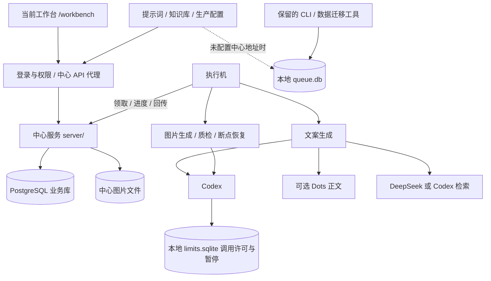

# 代码清理结果与保留边界

日期：2026-09-06。基于提交 `3823563` 的工作区；本报告已更新为实际清理结果，替代首轮候选清单。用户已明确下线 OpenClaw 和旧 Web 界面。

## 清理结果

本批删除 137 个文件，包含 36 个旧 API 路由文件；清理 835 条旧界面专属 CSS 选择器，移除 ExcelJS、class-variance-authority、@radix-ui/react-slot 三项直接依赖。统计包含旧测试及构建依赖，不代表业务功能数量。

| 编号 | 功能或结构 | 状态 | 删除范围与替代入口 |
| --- | --- | --- | --- |
| A01 | 未使用的质检导航、隐藏旧菜单 | 已删除 | 当前导航只保留工作台、内容资产和系统管理 |
| A02 | 通用中心组件中的提示词/知识库旧分支 | 已删除 | 配置组件仅处理生产设置；提示词和知识库保留各自当前组件 |
| A03 | 固定不显示的知识库介绍 | 已删除 | 保留知识列表、编辑、分析与发布 |
| D01 | OpenClaw 执行器及回退选择 | 已删除 | 统一 `createAgentClient → createCodexClient`；同步清理旧图片接收、追踪导出和搜索补丁 |
| D02 | 旧 Excel 导入与需求筛选 Web | 已删除 | 删除 `/imports`、旧导入 API、Excel 解析/筛选服务及模板；当前工作台批量 Query 提交保留 |
| D03 | 独立/批量文案与图片生成旧页面 | 已删除 | 删除各 generation 页面、专属 API 和组件；当前中心队列执行保留 |
| D04 | 旧任务、审核、统计与追踪页面 | 已删除 | 删除 `/tasks`、`/reviews`、`/analytics`、`/openclaw-traces` 及专属 API |
| D05 | 旧远端作业中心 `/jobs` | 已删除 | 使用 `/workbench/*`；首页跳转 `/workbench/personal` |
| D06 | 无运行入口的 Web 后端服务 | 已删除 | 旧素材上传、Excel 解析、需求筛选、本地文案知识分析、生成附件读取、本地 ZIP 导出 |
| D07 | 旧预览编辑分支和页面专属样式 | 已删除 | 当前图片预览的放大、适配、旋转、上一张/下一张保留 |

旧路由下线后返回 404，不再保留可触发旧模型调用的隐藏接口。旧审核角色不再被引导到已删除页面；当前 ADMIN、REVIEWER、USER 均可进入新首页。

## 当前功能地图

## 明确保留的核心功能

| 能力 | 主要代码 | 保留原因 |
| --- | --- | --- |
| 创作、人工审核、资源下载 | `app/workbench/`、`server/src/` | 当前生产入口；与旧 `/tasks`、`/reviews` 无关 |
| Codex 文本、视觉与原生生图 | `src/codex.mjs`、`src/codex-runtime.mjs` | 当前生成引擎；原生图片事件、文件校验、进程退出和许可释放保持 |
| 文案研究、生成与审核 | `src/copy-generation.mjs`、`src/content-stage-review.mjs` | 当前执行器共享；Dots 与 DeepSeek 保留 |
| 生图、图文对齐、质检、恢复 | `src/standalone-image-generation.mjs`、`src/images.mjs`、`src/executor/image-checkpoints.mjs` | `standalone` 文件名不代表废弃，仍由核心执行器调用 |
| 当前提示词和知识库 | `app/prompts/`、`app/knowledge/`、中心知识接口 | 版本、历史内容与当前分析流程保留 |
| CLI 队列、图片编辑和迁移 | `src/cli.mjs`、`src/admin/admin-store.mjs`、维护脚本 | 仍有运行入口；不拆共享数据库结构和历史记录 |
| 模拟执行器 | `src/executor/deepseek-*-simulator.mjs` | 保留内部联调；结果明确标记模拟，不声称由 Codex 生成 |

当前调用接口中的旧 `openclaw` 变量/参数名改为 `agentClient`，清除与实际引擎不符的命名。旧数据库来源枚举、历史校验兼容和本地队列既有熔断键保留，避免破坏历史数据恢复。

旧配置的 `agentProvider`、`copyGenerationProvider`、`webSearchProvider` 若为 `OPENCLAW`，读取时归一为 `CODEX`；不会加载旧执行器。新页面选择项与本地配置接口只接受当前提供方。历史执行记录没有批量改写。

## 本地 SQLite 到底有什么用

| 存储 | 保存内容 | 对当前三项配置的影响 |
| --- | --- | --- |
| 本地 `data/queue.db` | 旧单机任务、提示词版本、文案/视觉知识、生产设置及审核历史 | 没有 `CONTROL_PLANE_URL` 时，当前提示词、知识库和生产配置仍走本地分支 |
| 中心 PostgreSQL | 共享任务、账户、版本、知识和生产设置 | 配置了中心地址后，这三项从中心读取和保存 |
| Codex `limits.sqlite` | 同机跨进程调用许可、额度/认证暂停、冷却与崩溃许可回收 | 不保存提示词或知识内容；执行机仍需要 |

Web 业务库路径由 `XHS_DB_PATH` 覆盖；CLI 使用 `XHS_DATABASE_PATH`，默认均为 `data/queue.db`。Codex 状态库默认在 `CODEX_HOME/xhs-runtime/limits.sqlite`，可由 `XHS_CODEX_RUNTIME_DB` 覆盖。

**业务 SQLite 不是中心缓存，没有自动同步。** 中心地址缺失时才走本地；中心连接故障不会自动回退。本地分支也不构成完整离线 Web，因为当前登录依赖中心账户服务。

本次保留本地业务模式与实际数据库文件，没有执行数据迁移或删库。对于已经统一使用中心的部署，建议下一批核对并迁移本地独有数据后，取消这三项的本地读写分支；Codex 的运行状态 SQLite 单独保留。当前仍在使用的本地 CLI 应另行决定是否退役。

## 回归证据

| 检查 | 结果 |
| --- | --- |
| 清理前恢复依赖后的基线 | 根目录 800 项通过；最初缺包导致的测试失败已通过 `npm ci` 解决 |
| 最终根目录测试 | 620 项通过，0 失败、0 跳过；删除了旧功能专属测试，混合测试保留当前功能断言 |
| 中心服务测试 | 110 项通过，0 失败、0 跳过 |
| TypeScript 与生产构建 | 通过；构建路由表仅包含当前页面和保留接口 |
| Mock smoke | 通过，不消耗真实模型额度 |
| 浏览器：当前工作台 | 登录、读取任务、桌面布局、移动导航通过 |
| 浏览器：提示词 | 保存、发布 v2、保留 v1 历史通过 |
| 浏览器：生产与搜索配置 | 写入隔离中心通过；修复了搜索配置写请求缺少用户身份头的问题 |
| 浏览器：知识库及系统页面 | 知识库、执行机、用户、个人信息可加载 |
| 浏览器：旧入口 | 旧生产、审核、追踪页面及代表性旧 API 返回 404 |
| 浏览器错误 | 检查页面无脚本错误或失败的业务网络请求；忽略原有缺失 favicon |
| 模块依赖检查 | 从当前页面、CLI、执行器和维护脚本出发，未发现剩余 `src/` 整文件孤立模块；删除集合无残留静态导入 |

浏览器使用真实生产构建、真实中心 HTTP 路由和权限中间件，以及内存中的模拟数据仓库。没有启动生产 Worker，没有读取/写入实际业务库，也没有执行真实模型生成或部署。它不能代替真实 PostgreSQL 与模型端到端验收。

- [根目录测试日志](C:/Users/HMCD-0005/.codex/visualizations/2026/09/06/01a074a4-7c85-7fb1-b7f8-4934659677da/cleanup-root-final.log)
- [中心测试日志](C:/Users/HMCD-0005/.codex/visualizations/2026/09/06/01a074a4-7c85-7fb1-b7f8-4934659677da/cleanup-server-final.log)
- [构建日志](C:/Users/HMCD-0005/.codex/visualizations/2026/09/06/01a074a4-7c85-7fb1-b7f8-4934659677da/cleanup-build.log)
- [浏览器结果](C:/Users/HMCD-0005/.codex/visualizations/2026/09/06/01a074a4-7c85-7fb1-b7f8-4934659677da/cleanup-browser-results.json)

## 复查与撤回范围

本批按“第一次冗余代码清理”提交；源码提交不包含部署。原有端口调整继续保留，界面使用 3000。已更新 README、执行机部署说明、Codex 迁移说明和配置示例。

通过 Git diff 可按功能查看删除内容。若需撤回，应仅恢复本批文件和对应依赖变更，保留用户原有端口修改；不要用整个工作区重置覆盖其他改动。实际 SQLite、中心库、图片资产和任务检查点均保留。

CodeGraph 用于定位符号、引用与影响范围；辅助静态入口遍历用于复查整文件依赖，浏览器和测试用于验证当前行为。这不是生产流量审计，也不把静态零引用当作完整业务下线证据。
